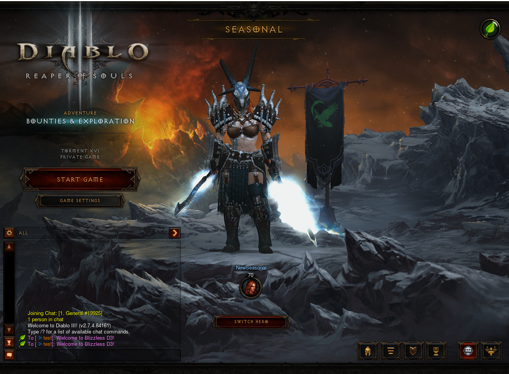
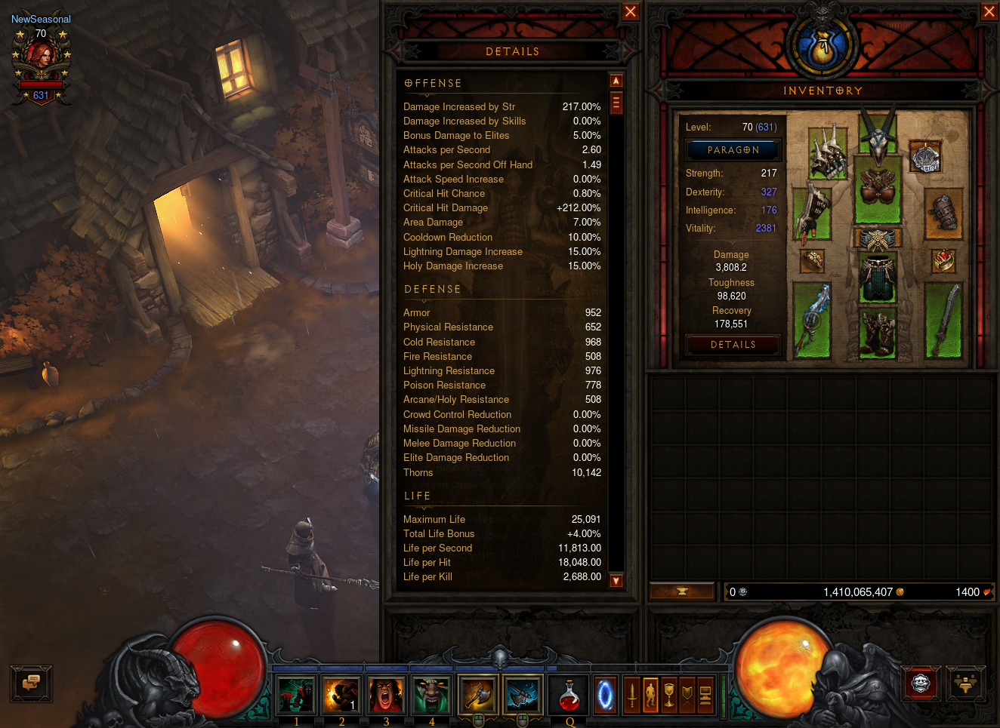
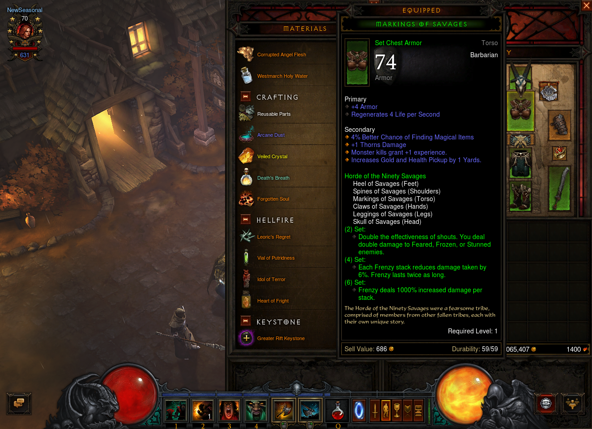
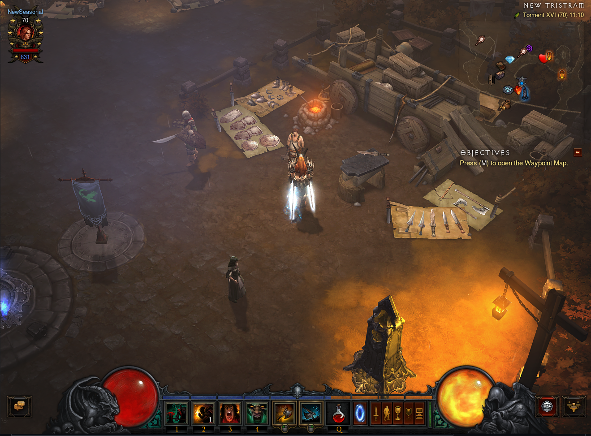
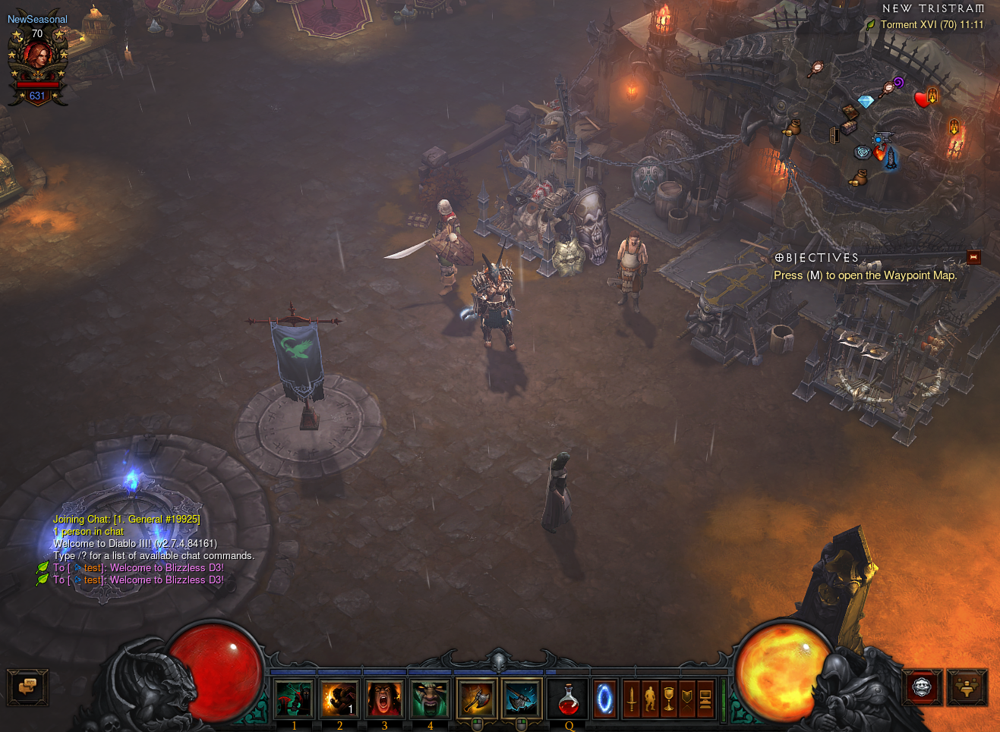
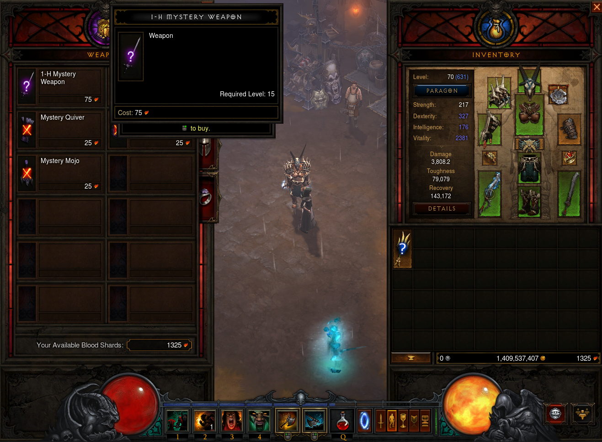
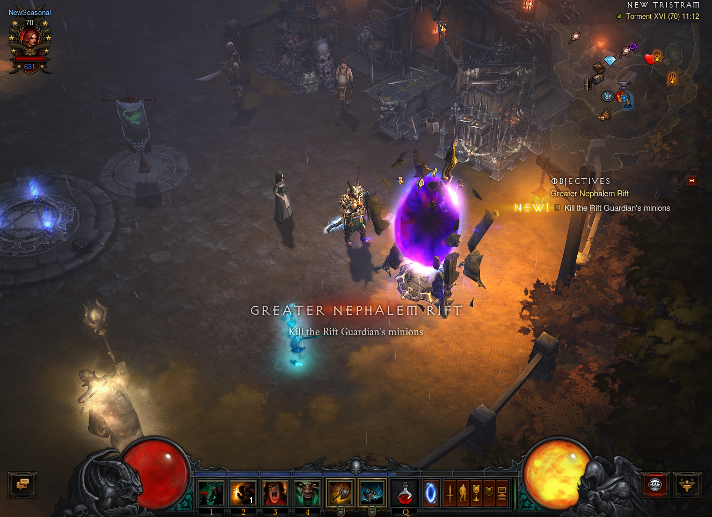
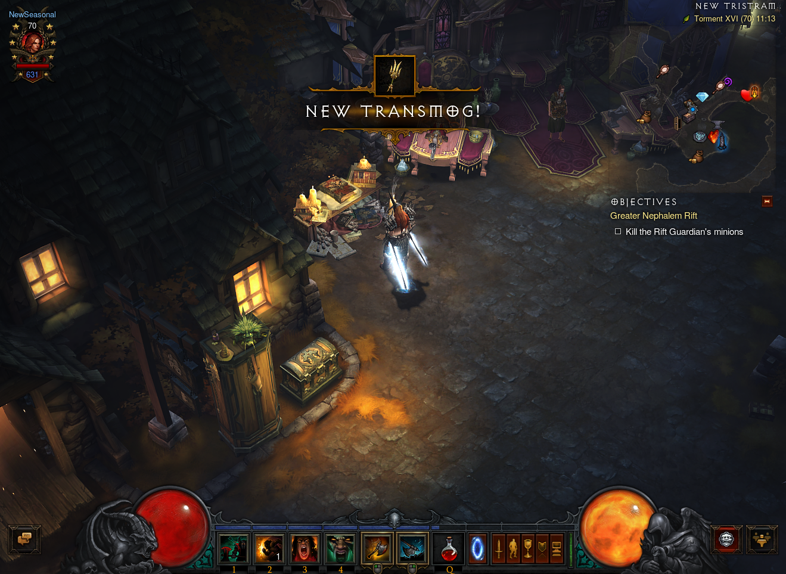

 


# DiIiS Project

DiIiS is a fully-functional open-source local server for [Diablo III: Reaper of Souls](https://eu.diablo3.blizzard.com).

# Disclaimer

[Disclaimer and Project Philosophy](disclaimer.md).

# Development

Developers, please contribute using the branch: **_community_**, always create your branches from it and also follow the Roadmap below.

# Enthusiasts

To test the server, use the **_test-stable_** or **_community_** branch

## Features

- Implemented account creation system, authorization and lobby.
- Implemented Necromancer class mechanics.
- Fully implemented chat system and friends.
- Fully implemented clan system.
- Implemented basic DRLG (dungeon generator).
- Implemented item generator with in-game affixes.
- Implemented the basic mechanics of almost all active abilities for all classes.
- Implemented a system of set items.
- Implemented all main scripts for all story quests 5 acts.
- Implemented basic scripts and generator for "Adventure Mode".
- Implemented the basis for the "Challenge Nephalem Rifts" mode.
- Implemented artificial intelligence for 80% of minions.
- Implemented personal artificial intelligence for 40% of all monsters.
- Implemented personal artificial intelligence for half of the Bosses.
- Implemented LAN

## Restrictions

- Donate Store implementation is removed.

# Installation

## Supported Clients

Each version of the client includes changes to structures, opcodes and attributes.

The currently supported version of the client: **2.7.4.84161**

## Server Deploying
### Prepare Database
#### Manual
1. Install [PostgreSQL 9.5.25](https://www.enterprisedb.com/downloads/postgres-postgresql-downloads).
2. Create databases in PostgreSQL: `diiis` and `worlds`.
3. Change you account and password in `database.Account.config` and `database.Worlds.conifg`.
4. Restore `worlds.backup` to `worlds` database.

#### Or using docker
1. [Install docker](https://docs.docker.com/get-docker/)
2. Run `docker-compose up` from root folder (here).

### Compile and run
1. Install [.NET 7 SDK and runtime](https://dotnet.microsoft.com/en-us/download/dotnet/7.0) (just runtime, not asp.net or desktop)
2. Go to the repo directory and compile the project using this command:
```shell
dotnet publish ./src/DiIiS-NA/Blizzless.csproj --configuration Release --output ./publish
```
3. __Skip this stage for local game__ Copy the [config.mods.json](https://github.com/blizzless/blizzless-diiis/blob/community/configs/config.mods.json) file to the folder, and modify however you want. A file will be generated automatically from the `config.ini` for now.
4. Update your `config.ini` file on the published folder with your network's IP records (`BindIP` and `PublicIP`)
5. Go to the publish folder, launch Blizzless executable, wait until server start - it creates a hierarchy.
6. Create user account(s) using console: `!account add Login Password Tag`
 - Example:
  - `!account add username@ YourPassword YourBattleTag`
 - Creates an account with Login `username@`, password `YourPassword` and BattleTag `YourBattleTag`
  - `!account add username@ YourPassword YourBattleTag owner`
 - Creates an account with Login `username@`, password `YourPassword` and BattleTag `YourBattleTag` with rank `owner`

### Example:

> !account add username@ YourPassword YourBattleTag

Creates an account with Login `username@`, password `YourPassword` and BattleTag `YourBattleTag`

> !account add username@ YourPassword YourBattleTag owner

Creates an account with Login `username@`, password `YourPassword` and BattleTag `YourBattleTag` with rank `owner`

### Example:

> !account add username@ YourPassword YourBattleTag

Creates an account with Login `username@`, password `YourPassword` and BattleTag `YourBattleTag`

> !account add username@ YourPassword YourBattleTag owner

Creates an account with Login `username@`, password `YourPassword` and BattleTag `YourBattleTag` with rank `owner`

## Prepare Client

Do this for each client connecting to the server.

1. Get [supported client](#supported-clients) D3 (2.7.4).

2. Install certificate [bnetserver.p12](src/DiIiS-NA/bnetserver.p12), password - `123` (the game verifies the CA root certificates).

3. Setting up redirects client to your server:

	**Method #1 - Hosts**

	  Add redirects to the `hosts` file (Windows - `%WinDir%\System32\drivers\etc\hosts`, Linux - `/etc/hosts`):  
	  `127.0.0.1 us.actual.battle.net`  
	  `127.0.0.1 eu.actual.battle.net`

	  !After the modification the official Battle.Net application will not be able to connect to the server!

	  **Method #2 - Modify main executable file**

	  ```c
	  // Find null-terminated string enum and rewrite with HexEditor to your IP server.
	  eu.actual.battle.net/
	  us.actual.battle.net/
	  cn.actual.battle.net/
	  kr.actual.battle.net/
	  ```

4. Launch client (`x64` or `x86`) with arguments `"Diablo III64.exe" -launch`

5. Login to the game using your credentials.

6. [Skip this stage for local game] After that, when creating a game (in client), indicate the creation of a public game. Other players, when connecting, must also indicate a public game, and at the start they will connect to you.

7. You're in the game world!

# Server Configuration

## Global configuration

Using the configuration file you can easily override the [global world parameters](docs/game-world-settings.md).

## Command system

The command system allows you to get control of the game world if you have rights. A list of commands is available [here](docs/commands-list.md).

# Issues

Check the [report form](docs/report-form.md) before submitting issue, this will help people save time!

# Development Roadmap – DIII Emulator

### 1️⃣ Rift / Greater Rift System

GR closure: ensure the Greater Rift closes automatically after 15 minutes.  
Exit portal: fix the teleport at the end of the GR so it appears and works correctly.  
Resource consumption: make sure the GR Stone and gold are properly consumed when energizing the rift.  
Death time penalty: implement the correct penalty (+5 seconds per death after the 3rd inside the GR).  
Mob removal: clear all enemies after a GR is finished.  
Next-level portal display: ensure the portal to the next GR level only appears when appropriate.  
Level display bug: fix the issue that shows only GR level 13 Torment 2.  
GR pillars validation: review and validate the behavior of GR pillars.  

### 2️⃣ Items & Crafting

Kanai’s Cube: fix legendary power extraction so it correctly consumes the required items.  
Enchant NPC: enable proper re-rolling of any item’s stats.  
Ramaladni’s Gift: ensure it correctly adds a socket to weapons.  
Gem validation: review the behavior of normal and legendary gems.  
Affix validation: confirm that all item affixes work as intended.  
Set bonus validation: review and adjust item set bonuses.  
Legendary bonus validation: ensure legendary powers are correctly applied (including duplicate checks).  
Boss drop validation: confirm that bosses drop the correct items.  

### 3️⃣ Progression & Gameplay

Waypoints:

Fix client crash when changing Sanctuary view with the + and – buttons.  
Correctly display the map name when clicked.  
Normal rift teleport: fix the portal that remains after a normal rift is closed.  
Character weapon display: fix the bug where the character’s weapon is not shown inside the GR.  
Difficulty save: store the last difficulty level used by the player for the next session.  

### 4️⃣ Bounties & Rewards

Bounty system: validate the full bounty system and its rewards.

### Suggested Priorities
Critical stability: GR closure, resource consumption, exit teleport, and waypoint fixes.  
Player progression: NPC upgrades, Kanai’s Cube, Ramaladni’s Gift, and difficulty saving.  
Balance & content: validations for gems, affixes, set bonuses, legendary bonuses, and boss drops.  
General improvements: visual fixes (weapon display) and overall gameplay polish.  

# System requirements

|            | **Entry-level**              | **Mid-range**                | **High-end**                 |
| ---------- | ---------------------------- | ---------------------------- | ---------------------------- |
| **CPU**    | Intel Core i5 or AMD Ryzen 5 | Intel Core i7 or AMD Ryzen 7 | Intel Core i9 or AMD Ryzen 9 |
| **Memory** | 4 GB RAM                     | 16 GB RAM                    | 64 GB RAM                    |
| **Disk**   | 500 MB                       | 1 GB                         | 1 GB                         |

# Screenshots

You can see more screenshots [here](SCREENSHOTS.md)










